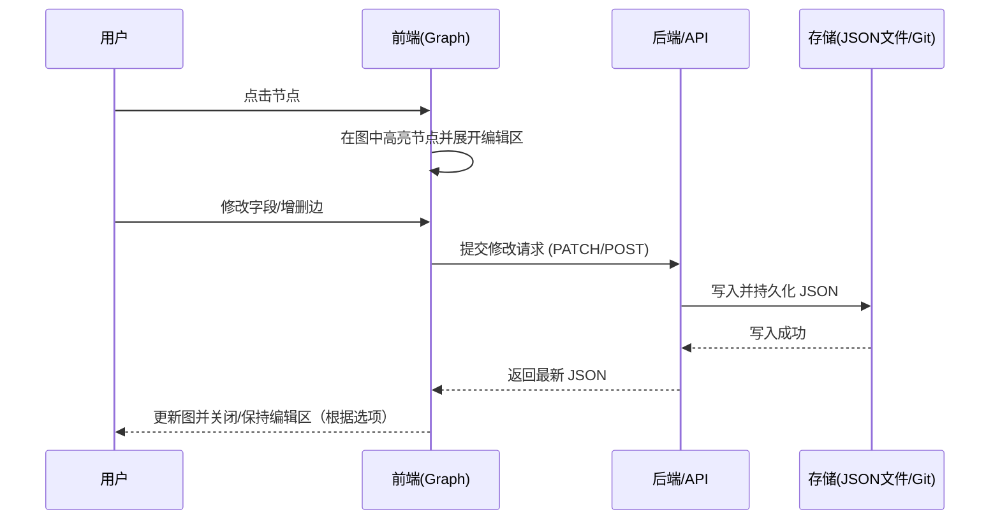

朋友图

## 概览

目标：把个人/朋友博客之间的友链组织成一个可交互的、有向图（directed graph），用于浏览、手工维护，并能通过手动触发的方式检查站点连通性（在线/离线状态）。最终页面替换原来 `/friends` 页面并部署到博客站点。

设计原则：

- 手工优先：不做大规模爬虫，内容由人输入或确认。程序只负责展现、存储和提供手动触发的探测（健康检查），检测由用户/维护者通过界面按钮触发。
- 简单持久：图数据以单一 JSON 文件存储，便于版本控制和备份。
- 交互性强：可视化图 + 编辑面板（点击节点展开编辑区，支持增删改、回车确认）。
- 可部署性：优先使用当前站点技术栈（Next.js）实现；同时提供无服务器/静态部署的兼容方案。

## 总体架构（自顶向下）

- 前端页面（Next.js）

  - 可视化图组件（Cytoscape.js / vis-network / @antv/g6 推荐之一）
  - 编辑区（点击节点时在图下方展开）：上半部分显示“来自该节点的已记录来源（incoming）”，下半部分显示“该节点通向的链接（outgoing）”，并配以说明文字、确认/取消按钮、回车提交。
  - 本地校验与图即时更新（乐观更新）

- 后端持久化与 API

  - 简单 REST API：GET /api/friends-graph -> 返回 JSON；POST /api/friends-graph -> 保存 JSON（需认证）
  - 存储实现可选：直接写文件（如果服务器允许），或通过 GitHub API 提交到仓库，或将 JSON 保存在第三方 KV（例如 Cloudflare KV）。

- 连通性检测（手动触发）
  - 在工具栏提供“手动连通性检测”按钮，由用户/维护者点击触发一次性检测。
  - 检测为轻量探测（HEAD 或 GET，短超时），检测结果写入节点的 status 字段并显示在前端。
  - 这样避免自动定期检测带来的频繁请求与权限问题，检测由人工节奏控制。

## 数据契约（JSON schema）

示例：

```json
{
	"nodes": [
		{
			"id": "ebotian_blog",
			"title": "Ebotian 的博客",
			"url": "https://ebotian.example/",
			"avatar": "/public/avatar.jpg", // 或 URL, 或 null
			"color": "#c0e0d0",
			"desc": "个人博客 / 记录",
			"meta": { "addedBy": "ebotian", "createdAt": "2025-10-06T08:00:00Z" },
			"status": {
				"online": true,
				"lastChecked": "2025-10-06T09:00:00Z",
				"httpStatus": 200
			}
		}
	],
	"edges": [{ "from": "ebotian_blog", "to": "friend_a", "label": "友链" }]
}
```

字段说明：

- nodes: 每个站点为一个节点，主键为 id（短字符串）。
- avatar: 建议优先由用户上传或填写图标 URL；程序可以提供“尝试提取站点 favicon/og:image”的可选动作（需要明确用户授权）。
- color: 字符头像的背景颜色（fallback）。
  -- status: 检测由手动触发的检测操作写入（readonly for 普通编辑操作，维护者触发检测时更新）。
- edges: 单向边，双向显示为两条对向边。

## 前端界面设计

页面分三区：

1. 顶部/左侧：工具栏（切换编辑/只读、导入/导出 JSON、手动触发连通性检测、备份/还原）
2. 中央：图展示区（可缩放、拖拽、搜索节点）
3. 下方：编辑区（当点击节点时展开）

编辑区具体要求（按你的描述）：

- 当点击图上的任意节点，编辑区展开并聚焦。光标移动到下半部分的编辑区准备添加当前节点要指向的新链接.编辑区分两部分：
  - 上半部分：当前节点的链接(默认只读)(旁边有编辑按钮触发写入)
  - 下半部分：当前节点通向的“outgoing list”（显示当前节点指向哪些节点）(默认折叠已有的部分)(新增的部分默认展开并且光标在输入框内)
  - 文本说明：每一部分左方写简短说明，例如“此站点链接”和“站点链接到”。
  - 按钮：确认（或回车）、取消。
  - 编辑行为：可以为当前节点修改 title、url、avatar（上传或粘贴 URL）、color、描述；也可以在 incoming/outgoing 列表中增删边（选择已有节点或输入新节点 id 并创建）。

键盘操作：回车等价于点击“确认”，Esc 等价于“取消”。

## 交互流程（Mermaid 时序图）



（已移除自动定时检测的流程图）

实现要点（手动检测）：

- 检测按钮触发一次轮询所有或部分节点的轻量请求（例如 HEAD，超时 3s）。
- 前端在检测期间显示进度/状态，检测完成后写回 `status` 并展示结果。
- 必要时允许维护者在检测时指定子集（例如按标签或手动输入）。

## 技术选型建议

- 可视化库：Cytoscape.js（交互强、布局多、支持样式化矩形节点）；备选 vis-network（更轻）；或 AntV G6（更复杂但功能强）。
- UI 框架：直接用当前 Next.js + Tailwind（项目已有 tailwind），或使用 React + Headless UI。
- 后端：Next.js API routes（若部署在支持写文件的服务器），或 GitHub API（使用 token 将修改 commit 到仓库），或 serverless 存储（Cloudflare KV / S3 + 简单 Lambda）。

## 权限与写入策略（现实考量）

两种可行策略：

1. 只允许维护者登录后编辑：前端展示公众查看模式并提供“编辑模式”登录入口（使用 GitHub OAuth 或静态 token），只有授权用户的客户端可以调用写 API。更安全也便于把 JSON 提交到仓库。
2. 开放式建议/草稿：任何人可以在 UI 中编辑本地视图并生成 JSON 的下载链接，由维护者审查并合并到仓库（更适合匿名公众参与但需要人工审核流程）。

## UI 边界情况与错误处理（至少覆盖这些）

- 节点 id 冲突：提示并要求更改 id 或自动生成唯一 id。
- 无效 URL：提交前做语法校验；连通性检测会进一步标注状态。
- 头像获取失败：提供上传/粘贴 URL 的 fallback；若没有则使用首字母+随机但温和的色彩。
- 大量节点：提供筛选/搜索、按社区/标签分组和延迟渲染（virtualization）策略。

## 最小可行实现（MVP）任务清单

1. 在 `src/pages/friends.tsx`（或 `src/pages/friends/index.tsx`）创建新页面，导入 Cytoscape.js 并展示 JSON 中的 nodes/edges。
2. 在页面下方实现折叠的编辑区，满足“上半部分 incoming、下半部分 outgoing、确认/取消、回车确认”需求。
3. 提供 `public/data/friends-graph.json` 作为数据源，并建立 `GET /api/friends-graph` 返回该文件。
4. 实现 `POST /api/friends-graph`：如果服务器允许写文件则写入；否则返回 403 并提供导出 JSON 的接口（前端可下载）。
5. 提供一个“手动连通性检测”功能：前端触发检测并更新 `status` 字段（后端执行轻量请求或前端直接发起请求，由部署环境决定安全与跨域）。
6. 调试与样式：把节点设为方形，头像放在方块中间；无头像时显示首字母。

## 可选扩展

- 支持导入/导出 GraphML 或 GEXF 以便用 Gephi 等工具分析。
- 在图上显示按照状态（在线/离线）着色边或节点的实时状态动画。
- 支持标签与分组（社区检测算法）并提供按标签过滤。

## 小结与下一步建议

本设计优先满足手工维护与可视化编辑两大需求：JSON 作为单一事实源，交互前端用 Cytoscape.js 显示并在底部提供符合你要求的编辑区（incoming / outgoing / 确认/取消/回车）。

建议下一步：我可以为你实现一个 MVP：

- 在仓库内新增 `src/pages/friends.tsx`（Next.js 页面）和 `public/data/friends-graph.json` 的示例；
- 使用 Cytoscape 渲染图、制作点击后展开的编辑区并实现本地保存（下载 JSON）和发送到 API 的能力。

如果你同意，我就开始生成 MVP 的文件并在本地运行一次简单的 Smoke 测试。也请告诉我你偏好的可视化库（Cytoscape / vis-network / G6）以及希望的存储方式（直接写文件 / GitHub 提交 / 仅导出下载）。
