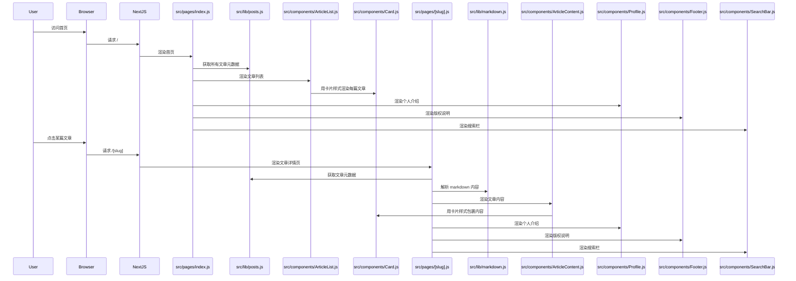
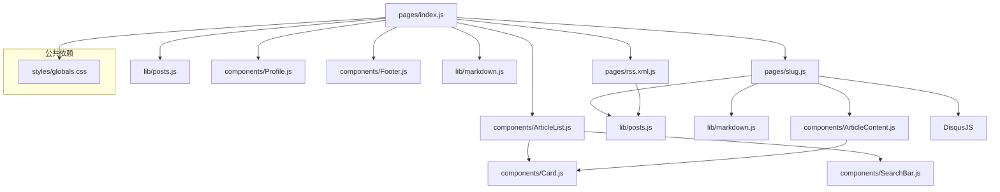

1. 必须使用nextjs在vercel上部署
2. 所有博客文章存储在posts目录下,均为md格式(需要被正确渲染)
3. 现代化的前端交互和个人博客展示风格(我喜欢复古未来80sDOS风格)
4. 不需要后端运行
5. 必须有良好的响应式设计
5. 需要有关键词搜索功能搜索文章
6. rss订阅以及DisqusJS评论功能
7. 需要有一个固定在页面上的简单的个人介绍(包含头像/社交账号/联系方式)
8. 版权保护说明
9. 集成 tailwindcss
10. 卡片式设计

实现样例:
根据你的需求文档，下面是详细的实现流程，适合新手参考：

1. Next.js 项目初始化与部署
- 在本地用 npx create-next-app 创建新项目。
- 初始化 git 仓库并推送到 GitHub。
- 在 Vercel 注册账号，导入你的 GitHub 仓库，选择 Next.js 自动部署。

2. 文章管理与渲染
- 在项目根目录下创建 posts 文件夹，将所有 .md 博客文章放入其中。
- 安装 gray-matter（解析 md 文件头信息）和 remark/rehype（渲染 markdown）。
- 在 pages 目录下创建 [slug].js（或 .tsx）页面，动态读取 posts 目录下的 md 文件并渲染为 HTML。
- 可用 getStaticPaths 和 getStaticProps 实现静态生成。

3. 80s DOS 复古未来风格 UI
- 选择合适的复古字体（如 IBM Plex Mono）。
- 使用 CSS（可选 styled-components 或 tailwindcss）自定义配色、边框、按钮等，模仿 DOS 风格。
- 参考 DOS UI 设计，制作顶部/侧边导航栏、窗口样式等。

4. 响应式设计
- 使用 CSS Flexbox/Grid 和媒体查询，确保在手机、平板、PC 上都能良好显示。
- 可用 tailwindcss 简化响应式开发。

5. 关键词搜索功能
- 在前端实现搜索框，输入关键词后在所有 md 文件内容和标题中查找匹配项。
- 可用 fuse.js 实现前端模糊搜索。
- 搜索结果动态展示，无需后端。

6. RSS 订阅
- 安装 rss 包，在项目根目录下创建 pages/rss.xml.js，自动读取 posts 目录生成 RSS XML。
- 在页面添加 RSS 订阅入口链接。

7. DisqusJS 评论
- 在文章详情页集成 DisqusJS（无需后端）。
- 参考 DisqusJS 官方文档，配置你的站点 shortname。

8. 固定个人介绍组件
- 创建一个全局组件（如 components/Profile.js），包含头像、社交账号、联系方式。
- 使用 CSS 让其固定在页面一角（如侧边栏或顶部）。
- 头像可用本地图片或外链，社交账号用图标+链接。

9. 版权保护说明
- 在页面底部或文章页添加版权声明。
- 可用全局 Footer 组件实现。

10. 其他建议
- 文章支持代码高亮，可用 rehype-prism-plus。
- 适当添加动画效果提升交互体验。
- 项目结构建议：components/（组件）、pages/（页面）、styles/（全局样式）、lib/（工具函数）、public/（静态资源）。





```txt
⠀⠀⠀⠀⠀⠀⠀⠀⠀⠀⠀⠀⠀⠀⠀⢀⣀⣀⣀⠀⠀⠀⠀⠀⠀⠀⠀
⠀⠀⠀⠀⠀⠀⠀⠀⠀⠀⠀⠀⣠⡴⢿⠻⡟⢿⢻⢿⣷⣦⣄⠀⠀⠀⠀
⠀⠀⠀⠀⠀⠀⠀⠀⠀⠀⢀⡞⢧⡙⡬⢓⡜⢢⠏⢦⡙⣻⣿⣷⡄⠀⠀
⠀⠀⠀⠀⠀⠀⠀⣄⠠⡴⣏⢜⡹⣏⢷⡩⠜⣗⢪⡱⠜⡤⢛⣿⣿⡄⠀
⠀⠀⠀⠀⠀⠀⠀⠀⢰⢫⡔⣮⡗⣹⡞⣧⢋⣷⣊⡴⢻⡜⣡⢻⣿⣿⡀
⠀⠀⠀⠀⠀⠀⠀⠀⡟⡆⠾⡽⢹⢯⡝⣻⣯⠋⢯⡿⣹⡜⣡⠞⣿⣿⡇
⠀⠀⠀⠀⠀⠀⠀⠀⢻⣌⢳⣷⢤⣿⣭⠉⢉⡵⣾⣧⢽⡞⣤⢻⣿⣿⣷
⠀⠀⠀⠀⠀⠀⠀⠀⠈⢺⣧⢿⡏⠋⠃⠀⠀⠈⠉⣩⣟⣼⣧⣿⣿⣿⡟
⠀⠀⠀⠀⠀⠀⠀⠀⠀⠀⣏⠶⡹⣆⣤⣰⣅⢴⣋⣵⠫⣍⠲⣿⣿⠟⠁
⠀⠀⠀⠀⠀⠀⠀⠀⠀⠀⢯⡖⡱⣩⢿⡛⢋⣠⡾⢌⠳⣌⠗⠋⠁⠀⠀
⠀⠀⠀⠀⠀⠀⠀⠀⠀⠀⠀⣼⣷⣵⣯⣿⡏⣿⣷⣯⣝⣿⡄⠀⠀⠀⠀
⠀⠀⠀⠀⠀⠀⠀⠀⠀⠀⠀⣷⣼⣿⣼⣿⣧⣿⣿⣿⣬⣿⣿⡀⠀⠀⠀
⠀⠀⠀⠀⠀⠀⠀⠀⠀⠀⣸⣿⣿⡏⣿⣿⢿⣿⣿⣿⣿⣿⣿⣧⠀⠀⠀
⠀⠀⠀⠀⠀⠀⠀⠀⠀⢠⣿⣿⣿⣿⣿⣿⣾⣿⣿⣿⣿⣿⣿⣿⡆⠀⠀
⠀⠀⠀⠀⠀⠀⠀⠀⢀⣿⣿⣿⣿⣿⣿⣿⣿⣿⣿⣿⣿⣿⣿⣿⣷⠀⠀
⠀⠀⠀⠀⠀⠀⠀⠀⣼⣿⣿⣿⣿⣿⣿⣿⣿⣿⣿⣿⣿⣿⣿⣿⣿⡆⠀
⠀⠀⠀⠀⠀⠀⠀⢰⣿⣿⣿⣿⣿⣿⣿⣿⣿⣿⣿⣿⣿⣿⣿⣿⣿⣇⠀
⠀⠀⠀⠀⠀⠀⢠⣿⣿⣿⣿⣿⣿⣿⣿⣿⣿⣿⣿⣿⣿⣿⣿⣿⣿⣿⠀
⠀⠀⠀⠀⠀⠀⢸⣿⣿⣿⣿⣿⣿⣿⣿⣿⣿⣿⣿⣿⣿⣿⣿⣿⣿⣿⠀
⠀⠀⠀⠀⠀⠀⠈⢿⣿⣿⣿⣿⣿⣿⣿⣿⣿⣿⣿⣿⣿⣿⣿⣿⡿⠋⠀
⠀⠀⠀⠀⠀⠀⠀⠀⠈⣿⣿⣿⣿⣿⣿⣿⣿⣿⣿⣿⣿⣿⡟⠉⠀⠀⠀
⠀⠀⠀⠀⠀⠀⠀⠀⠀⠈⡏⢹⡉⠉⠹⠉⠉⠉⣿⠉⠉⢹⠁⠀⠀⠀⠀
⠀⠀⠀⠀⠀⠀⠀⠀⠀⠀⢰⣬⣧⣤⣤⣧⣤⣴⣧⣴⣶⡎⠀⠀⠀⠀⠀
⠀⠀⠀⠀⠀⠀⠀⠀⠀⠀⠀⣯⠋⣫⠊⡟⢴⠛⣴⠳⣨⠃⠀⠀⠀⠀⠀
⠀⠀⠀⠀⠀⠀⠀⠀⠀⠀⠀⢰⠵⣁⡵⣹⡁⡳⡈⣶⣸⠀⠀⠀⠀⠀⠀
⠀⠀⠀⠀⠀⠀⠀⠀⠀⠀⠀⠀⣧⠚⣤⠺⠍⢦⠚⢄⡆⠀⠀⠀⠀⠀⠀
⠀⠀⠀⠀⠀⠀⠀⠀⠀⠀⠀⠀⢸⢮⢈⢶⡷⡃⡱⡇⡇⠀⠀⠀⠀⠀⠀
⡀⠀⠀⠀⠀⠀⠀⠀⠀⠀⠀⠀⢸⢤⠫⡠⢣⠜⢢⠜⣶⠀⠀⠀⠀⠀⠀
```